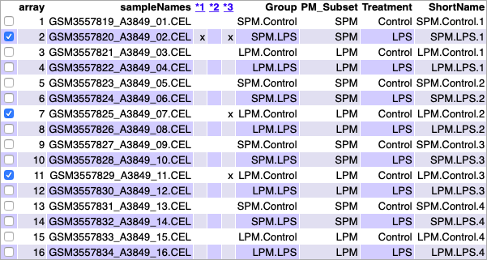
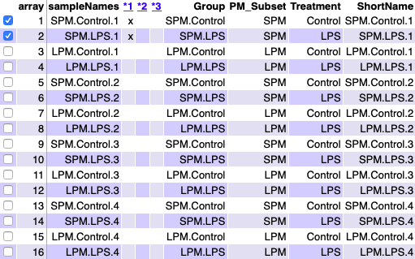

```{r setup, include=FALSE}
knitr::opts_chunk$set(echo = TRUE)
```
&nbsp;

# Resumen

En este documento se presenta el análisis de datos de microarrays, de un estudio público, utilizando paquetes R y Bioconductor. El flujo de trabajo comienza con los datos sin procesar y pasa por una serie de pasos como son la identificación y lectura de los datos sin procesar, control de calidad, normalización, filtraje, selección de genes diferencialmente expresados, anotación génica, comparación de listas seleccionadas y análisis de significancia biológica. Los datos y el código para el análisis se proporcionan en un repositorio de github^[https://github.com/carlariera/AnalisisMicroarrays].
&nbsp;

# Objetivos

De cada paciente estudiado (4 en total), primero se clasificaron los macrófagos peritoneales (PM) en dos tipos según su tamaño (SPM y LPM) para ver cómo reaccionaban ante la infección bacteriana del E.Coli (LPS). 

Así pues, el objetivo principal fue comparar qué genes activan los SPMs y los LPMs (por separado) ante la respuesta bacteriana, además de caracterizar la heterogeneidad de los macrófagos peritoneales en la cirrosis hepática descompensada.
&nbsp;

# Materiales

Los datos utilizados se cargaron en el Omnibus de expresión génica (GEO). El conjunto de datos seleccionado corresponde a un estudio realizado por @Stengel2020 y se identifica con el número de acceso **GSE124878**.

El nivel de superfície de CD206 se utilizó para identificar PMs inflamatorios, maduros y residentes en pacientes con cirrosis. Los subconjuntos de PM (SPM y LPM) se clasificaron por citometría de flujo y las células clasificadas se sembraron en placas de cultivo celcular y se trataron con 10 ng/ml de lipopolisacárido de E.Coli (LPS) durante 3h o se dejaron sin tratar. 

El experimento comparó, en 4 pacientes, los dos subconjuntos de PMs, macrófagos peritoneales pequeños (SPMs) y macrófagos peritoniales grandes (LPMs) con dos tratamientos distintos, sin tratamiento (Control) o después del tratamiento durante 3h con lipopolisacárido de E.Coli (LPS). Es decir, era un diseño factorial 2x2 (tipo de PM y tipo de tratamiento) con dos niveles cada uno (pequeño y grande para tipo de PM; control y LPS para tipo de tratamiento).

El tamaño de la muestra del experimento es de 16 muestras, cuatro réplicas de cada grupo.

Los microarrays utilizados para este experimento fueron del tipo *Clariom S Human HT* de Affymetrix.
&nbsp;

# Métodos

Antes de comenzar, debemos organizar en distintas carpetas el espacio desde donde trabajermos, con el fin de evitar perderse ya que se administrarán una gran cantidad de archivos.

Así pues, creamos la carpeta **AnalisisMicroarrays** que será el directorio de trabajo y dentro de ella creamos dos carpetas: una llamada **data** donde guardaremos todos los archivos *.CEL* y el archivo *targets* con información sobre las covariables; y otra llamada **results** donde enviaremos todos los resultados obtenidos en el análisis de microarrays.
```{r}
# Definición del directorio
setwd(".")
```

## Identificación y lectura de los datos

Como se ha detallado anteriormente, tenemos 16 muestras, divididas en 4 grupos distintos: LPMs Control (LPM.Control), SPMs Control (SPM.Control), LPMs con tratamiento LPS (LPM.LPS) y SPM con tratamiento LPS (SPM.LPS); con 4 réplicas de cada uno.

Para realizar cualquier análisis, debemos contar con los archivos *.CEL* (los cuales hemos descargado del GEO) y del archivo *targets*, el cual debe relacionar el nombre de cada archivo *.CEL* con su condición en el experimento.

### Preparación del archivo *targets*

Nuestro archivo *targets* contiene 5 columnas. *FileName* contiene el nombre exacto de los archivos *.CEL*; *Group* contiene de manera resumida las condiciones del experimento para esa muestra; *PM_Subset* indica el tipo conjunto de macrófagos peritoniales; *Treatment* el tipo de tratamiento; y *ShortName* contiene una etiqueta corta con la información más relevante de la muestra.
```{r ReadTargets}
# Archivo targets
targets <- read.csv2("./data/targets.csv", header = TRUE, sep = ";") 
knitr::kable(targets, booktabs = TRUE, caption = 'Contenido del archivo targets utilizado para el análisis')
```

### Lectura de los archivos .CEL

Para leer los archivos *.CEL* de la carpeta usamos la función *list.celfiles()*. Posteriormente, con la función *read.AnnotatedDataFrame()* asociamos la información almacenada en los archivos *.CEL* con el archivo *targets* en una sola variable llamada *rawData* (datos crudos, sin procesar). El archivo creado es conocido como *ExpressionSet* y en él se almacena toda la información disponible sobre el experimento.
```{r ReadCELfiles, message=FALSE, results='hide', warning=FALSE}
# Creación del objeto ExpressionSet
library(oligo)
celFiles <- list.celfiles("./data", full.names = TRUE)
library(Biobase)
my.targets <- read.AnnotatedDataFrame(file.path("./data","targets.csv"), header = TRUE, row.names = 1, sep=";") 
rawData <- read.celfiles(celFiles, phenoData = my.targets)
```

Una vez creado el *ExpressionSet*, procedemos a cambiar el nombre largo de las muestras en etiquetas más cortas (columna *ShortName* del archivo *targets*) con el fin de facilitar el procedimiento y la interpretación.
```{r ChangeName}
# Cambio del nombre de las filas del ExpressionSet
my.targets@data$ShortName->rownames(pData(rawData))
colnames(rawData) <-rownames(pData(rawData)) 

head(rawData)
```

## Control de calidad de los datos crudos

Para conocer la calidad de los datos sin procesar, procedemos a realizar el análisis de calidad de los datos crudos utilizando la función *arrayQualityMetrics()*. 
```{r QCRaw, message=FALSE, warning=FALSE, eval=FALSE}
# Análisis de calidad de los datos crudos
library(arrayQualityMetrics)
arrayQualityMetrics(rawData)
```

Vamos a echarle un vistazo al archivo generado *index.html*:
```{r QCRawDataRes, out.width = "450px", fig.align='center', fig.cap="Aspecto de la tabla resumen del fichero index.html, producida por el paquete arrayQualityMetrics sobre los datos crudos", echo=FALSE}

```

Podemos observar que hay tres muestras (2, 7 y 11) que han sido marcadas con una cruz como valores atípicos. De hecho, la muestra 2, en particular, presenta 2 cruces. Sin embargo, ya que ninguna de ellas ha sido marcada 3 veces (punto en el que debe revisarse la exclusión de una muestra para mejorar la calidad), podemos afirmar que los datos crudos de este experimento tienen suficiente calidad para la normalización.

A continuación, vamos a obtener un análisis más completo de los componentes principales para los datos sin procesar.
```{r}
library(ggplot2)
library(ggrepel)
plotPCA3 <- function (datos, labels, factor, title, scale, colores, size = 1.5, glineas = 0.25) {
  data <- prcomp(t(datos),scale=scale)
  # Ajustes del plot
  dataDf <- data.frame(data$x)
  Group <- factor
  loads <- round(data$sdev^2/sum(data$sdev^2)*100,1)
  # Plot principal
  p1 <- ggplot(dataDf,aes(x=PC1, y=PC2)) +
    theme_classic() +
    geom_hline(yintercept = 0, color = "gray70") +
    geom_vline(xintercept = 0, color = "gray70") +
    geom_point(aes(color = Group), alpha = 0.55, size = 3) +
    coord_cartesian(xlim = c(min(data$x[,1])-5,max(data$x[,1])+5)) +
    scale_fill_discrete(name = "Grupo")
  # Evitación de la superposición de etiquetas
  p1 + geom_text_repel(aes(y = PC2 + 0.25, label = labels),segment.size = 0.25, size = size) + 
    labs(x = c(paste("PC1",loads[1],"%")),y=c(paste("PC2",loads[2],"%"))) +  
    ggtitle(paste("Análisis de componentes principales para",title,sep=" "))+ 
    theme(plot.title = element_text(hjust = 0.5)) +
    scale_color_manual(values=colores)
  }
```

Mostramos el diagrama de dispersión de los dos componentes principales realizado sobre los datos crudos.
```{r PCARaw, message=FALSE, fig.align='center', fig.cap="Visualización de los dos componentes principales para datos crudos"}
plotPCA3(exprs(rawData), labels = targets$ShortName, factor = targets$Group, 
         title="datos crudos", scale = FALSE, size = 3, 
         colores = c("brown", "green", "orange", "purple"))
```

El primer componente de la PCA (*Principal Component Analysis*) representa el 41.7% de la variabilidad total de las muestras, la cual se debe principalmente a la condición del tipo de PMs ya que las muestras de macrófagos peritoneales grandes (LPMs) se encuentran a la derecha y las muestras de macrófagos pequeños (SPMs) están a la izquierda. Cabe destacar que las muestras 2 y 3 del grupo SPM.Control se encuentran fuera del que sería su cuadrante, y lo mismo sucede con la muestra 1 del grupo LPM.LPS.

El segundo componente de la PCA representa el 20.3% de la variabilidad total de las muestras, la cual se debe a la condición del tipo de tratamiento ya que las muestras que no han sido sometidas a tratamiento (Control) se encuentran en la parte superior y las muestras sometidas a tratamiento (LPS) están en la parte inferior.

Vamos ahora a visualizar la distribución de intensidad de las matrices usando bloxplots o diagramas de caja.
```{r BoxplotRaw, message=FALSE, fig.align='center', fig.cap="Distribución de las intensidades de los datos crudos"}
boxplot(rawData, cex.axis=0.5, las=2,  which="all", 
         col = c(rep("brown", 4), rep("green", 4), rep("orange", 4), rep("purple", 4)),
         main="Distribución de los valores de intensidad de los datos crudos")
```

Podemos observar una ligera variación de intensidad entre los arrays, aunque era esperable ya que estamos tratando con los datos brutos.

## Normalización de los datos

Una vez hemos realizado el control de calidad vamos a proceder a normalizar los datos y sumarizarlos para conseguir que las matrices sean comparables entre ellas y tratar de reducir, y si es posible eliminar, toda la variabilidad en las muestras que no se deba a razones biológicas.

Para ello utilizaremos el método RMA, el cual implica 3 etapas: corrección de fondo, normalización para hacer que los valores de los arrays sean comparables y resumen de las diversas sondas asociadas a cada grupo de sondas para dar un único valor.
```{r Normalization}
# Normalización de los datos
eset_rma <- rma(rawData)
```

## Control de calidad de los datos normalizados

Para conocer la calidad de los datos normalizados vamos a realizar el análisis de calidad  utilizando la función *arrayQualityMetrics()* tal y como se ha hecho anteriormente.
```{r QCNorm, message=FALSE, warning=FALSE, eval=FALSE}
# Análisis de calidad de los datos normalizados
arrayQualityMetrics(eset_rma, outdir = file.path("./results", "QCDir.Norm"), force = TRUE)
```

Vamos a echarle un vistazo al archivo generado *index.html*:
```{r QCNormDataRes, out.width = "450px", fig.align='center', fig.cap="Aspecto de la tabla resumen del fichero index.html, producida por el paquete arrayQualityMetrics sobre los datos normalizados", echo=FALSE}

```

Podemos observar que ahora hay 2 muestras (1 y 2) que han sido marcadas con una cruz como valores atípicos, y por tanto, concluimos que los datos normalizados tienen suficiente calidad.

Tal y como hemos realizado en apartados previos, vamos a obtener un análisis más completo de los componentes principales para los datos normalizados.
```{r PCANorm, message=FALSE, fig.align='center', fig.cap="Visualización de los dos componentes principales para datos normalizados"}
plotPCA3(exprs(eset_rma), labels = targets$ShortName, factor = targets$Group, 
         title="datos normalizados", scale = FALSE, size = 3, 
         colores = c("brown", "green", "orange", "purple"))
```

Ahora el primer componente de la PCA representa el 33% de la variabilidad total, la cual cosa supone una disminución con respecto a la PCA realizada para datos crudos. De la misma manera que con el PCA para datos sin procesar, las muestras son separadas a derecha e izquierda por el tipo de PMs, y arriba y abajo por el tipo de tratamiento. Podemos observar que las muestras 2 y 3 del grupo SPM.Control han quedado más agrupadas con las otras de su grupo con la normalización de los datos, y lo mismo ha sucedido con la muestra 1 del grupo LPM.LPS.

Vamos ahora a visualizar la distribución de intensidad de las matrices usando bloxplots o diagramas de caja.
```{r BoxplotNorm, message=FALSE, fig.align='center', fig.cap="Distribución de las intensidades de los datos normalizados"}
boxplot(eset_rma, cex.axis=0.5, las=2,  which="all", 
         col = c(rep("brown", 4), rep("green", 4), rep("orange", 4), rep("purple", 4)),
         main="Distribución de los valores de intensidad de los datos normalizados")
```

Como era de esperar, la distribución de todos los arrays tiene un aspecto muy similar, la cual cosa sugiere que la normalización ha funcionado bien.

## Filtraje no específico

Realizada la normalización, puede realizarse un filtraje no específico con el fin de eliminar genes que constituyen básicamente ruido. Bien porque sus señales son muy bajas o bien porque apenas varían entre condiciones, por lo que no aportan nada a la selección de genes diferencialmente expresados.

Con el fin de detectar y eliminar los errores introducidos por variaciones experimentales del tiempo y el lugar (efectos por lotes) vamos a realizar un análisis de componentes de variación principal (PVCA). Este análisis estima la fuente y la proporción de variación en dos pasos: análisis de componentes principales y análisis de componentes de varianza.

Primero vamos a observar si las muestras fueron procesadas en el mismo día utilizando el comando *get.celfile.dates()*.
```{r}
library(affyio)
get.celfile.dates(celFiles)
```
 
Partiendo del conocimiento que todas las muestras se procesaron el mismo día (10 de julio de 2018), procedemos a realizar el análisis PVCA.
```{r BatchDetection, message=FALSE, warning=FALSE}
library(pvca)
pData(eset_rma) <- targets
pct_threshold <- 0.6
batch.factors <- c("PM_Subset", "Treatment")
pvcaObj <- pvcaBatchAssess (eset_rma, batch.factors, pct_threshold)
```

Graficamos los resultados del análisis, donde cada barra corresponde a cada fuente de variación incluida en el análisis y su tamaño indica el porcentaje de variabilidad atribuible a cada fuente.
```{r plotPVCA, fig.align='center', fig.cap="Importancia relativa de los diferentes factores - tipo de PMs, tratamiento e interacción - que afectan a la expresión génica"}
bp <- barplot(pvcaObj$dat, xlab = "Efectos",
  ylab = "Variación de la proporción promedio ponderada",
  ylim= c(0,0.6),col = c("mediumorchid"), las=2,
  main="Estimación PVCA")
axis(1, at = bp, labels = pvcaObj$label, cex.axis = 0.75, las=2)
values = pvcaObj$dat
new_values = round(values , 3)
text(bp,pvcaObj$dat,labels = new_values, pos=3, cex = 0.7)
```

Podemos observar que la principal fuente de variación en las muestras es la condición del tipo de PM (SPM o LPM).

### Detección de los genes más variables

Cuando un gen se expresa de manera diferencial, se espera que haya una cierta diferencia entre los grupos y, por lo tanto, la varianza general del gen será mayor que la de aquellos que no tienen expresión diferencial. 

Así pues, vamos a trazar la variabilidad general de todos los genes, donde se representan las desviaciones estándar de todos ellos ordenados de menor a mayor valor.
```{r SDplot, fig.align='center', fig.cap="Valores de las desviaciones estándar de todas las muestras para todos los genes ordenados de menor a mayor"}
sds <- apply (exprs(eset_rma), 1, sd)
sdsO<- sort(sds)
plot(1:length(sdsO), sdsO, main="Distribución de variabilidad para todos los genes",
     sub="Las líneas verticales representan los percentiles 90% y 95%",
     xlab="Índice de genes (de menos a más variable)", ylab="Desviación estándar")
abline(v=length(sds)*c(0.9,0.95))
```

El gráfico muestra que los genes más variables son aquellos con una desviación estándar superior al 90-95% de todas las desviaciones estándar.

### Filtración de los genes menos variables

Vamos a filtrar aquellos genes que no se espera que se expresen diferencialmente. Para ello, podemos utilizar la función *nsFilter()* que permite eliminar los genes que, o bien varían poco, o bien no se dispone de anotación para ellos.
```{r Filtering1, results='hide', message=FALSE}
library(genefilter)
library(clariomdhumantranscriptcluster.db)
annotation(eset_rma) <- "clariomdhumantranscriptcluster.db"
filtered <- nsFilter(eset_rma, require.entrez = TRUE, remove.dupEntrez = TRUE,var.filter=TRUE, var.func=IQR, var.cutoff=0.75, filterByQuantile=TRUE, feature.exclude = "^AFFX")
```

La función *nsFilter()* devuelve los valores filtrados en un objeto *ExpressionSet* y un informe de los resultados del filtraje.
```{r FilterResults1, results='hide', echo=FALSE}
names(filtered)
class(filtered$eset)
```

```{r FilterResults2}
print(filtered$filter.log)
eset_filtered <- filtered$eset
```

Al inicio del estudio contábamos con 27189 genes, valor que ha quedado reducido a 4632, después de eliminar todos los genes que no se expresan diferencialmente (27189 - 86 - 13894 - 8577 = 4632). Los genes que quedan después de filtrar han sido almacenados en la variable *eset_filtered*.

Comprobamos el valor de genes restantes después del filtraje con el siguiente código.
```{r}
# Genes restantes después del filtraje
dim(exprs(eset_filtered))[1]
```

### Almacenaje de datos normalizados y filtrados

Procedemos a guardar los datos filtrados normalizados para futuros análisis.
```{r SaveData1, results='hide', message=FALSE}
write.csv(exprs(eset_rma), file="./results/normalized.Data.csv")
write.csv(exprs(eset_filtered), file="./results/normalized.Filtered.Data.csv")
save(eset_rma, eset_filtered, file="./results/normalized.Data.Rda")
```

## Selección de genes diferencialmente expresados

Para seleccionar los genes diferencialmente expresados de este estudio, vamos a utilizar la aproximación presentada por Smyth del paquete *limma*. Ésta se basa en la utilización del modelo lineal general, combinada con un método para obtener una estimación mejorada de la varianza.

### Creación de la matriz de diseño

El primer paso para el análisis basado en modelos lineales es la creación de la matriz de diseño.
```{r LoadSavedData}
if (!exists("eset_filtered")) load (file="./results/normalized.Data.Rda")
```

La matriz de diseño estará compuesta por 16 filas (muestras del estudio) y por 4 columnas (grupos). La variable *Group* es una combinación de las dos condiciones experimentales: SPM/LPM y Control/LPS, que se representan conjuntamente como un factor de 4 niveles.
 + SPM.Control (presencia de LPMs y sin tratamiento)
 + SPM.LPS (presencia de LPMs y sin tratamiento)
 + LPM.Control (presencia de LPMs y sin tratamiento)
 + LPM.LPS (presencia de LPMs y con tratamiento LPS)
```{r DesignMatrix, message=FALSE}
library(limma)
designMat<- model.matrix(~0+Group, pData(eset_filtered))
colnames(designMat) <- c("LPM.Control", "LPM.LPS", "SPM.Control", "SPM.LPS")
print(designMat)
```

### Definición de comparaciones con la matriz de contrastes

Ahora vamos a crear la matriz de contrastes para describir las comparaciones entre grupos.

En este estudio queremos verificar el efecto de la aplicación o no del tratamiento con E.Coli (Control vs LPS) por separado para los SPMs y los LPMs. Además, también queremos comprobar si existe diferencia entre el tipo de macrófagos peritoneales. Esto se puede hacer haciendo tres comparaciones que se describen a continuación:
```{r setContrasts}
cont.matrix <- makeContrasts (SPM.LPSvsControl = SPM.LPS-SPM.Control,
                              LPM.LPSvsControl = LPM.LPS-LPM.Control,
                              PM = SPM.Control-LPM.Control,
                              levels=designMat)
print(cont.matrix)
```

En definitiva, la matriz de contraste se ha definido para realizar tres comparaciones:
 + Aplicación del tratamiento LPS en macrófagos peritoneales pequeños (SPMs)
 + Aplicación del tratamiento LPS en macrófagos peritoneales grandes (LPMs)
 + Diferencia entre el tipo de macrófago (SPM vs LPM)

### Estimación del modelo y selección de genes

Una vez definida la matriz de diseño y los contrastes, podemos pasar a estimar el modelo, estimar los contrastes y realizar las pruebas de significación, para cada gen y cada comparación, si pueden considerarse diferencialmente expresados.

Toda la información relevante para una mayor exploración de los resultados la almacenamos en un objeto R de la clase MArrayLM definida en el paquete *limma*, al que se nombra como *fit.main*.
```{r, linearmodelfit}
library(limma)
fit<-lmFit(eset_filtered, designMat)
fit.main<-contrasts.fit(fit, cont.matrix)
fit.main<-eBayes(fit.main)
class(fit.main)
```

### Obtención de listas de genes expresados diferencialmente

Para obtener una lista de genes ordenadors de más a menos diferencialmente expresados para cada contraste, podemos hacer uso de la función *topTable()*.

Para la comparación 1 (SPM.LPSvsControl): genes que cambian su expresión entre LPS y Control en macrófagos peritoneales pequeños.
```{r, topTabs1}
topTab_SPM.LPSvsControl <- topTable (fit.main, number=nrow(fit.main), coef="SPM.LPSvsControl", adjust="fdr") 
head(topTab_SPM.LPSvsControl)
```

Para la comparación 2 (LPM.LPSvsControl): genes que cambian su expresión entre LPS y Control en macrófagos peritoneales grandes.
```{r, topTabs2}
topTab_LPM.LPSvsControl <- topTable (fit.main, number=nrow(fit.main), coef="LPM.LPSvsControl", adjust="fdr") 
head(topTab_LPM.LPSvsControl)
```

Para la comparación 3 (PM): genes que se cambian su expresión entre SPM y LPM.
```{r, topTabs3}
topTab_PM  <- topTable (fit.main, number=nrow(fit.main), coef="PM", adjust="fdr") 
head(topTab_PM)
```

## Anotación génica

La anotación génica consiste en adivinar qué gen corresponde a cada ID de Affymetrix (primera columna de las tablas).

Debido a que hay 3 tablas, vamos a ejecutar la siguiente función para hacerlo más simple.
```{r GeneAnnotation, message=FALSE, warning=FALSE}
annotatedTopTable <- function(topTab, anotPackage)
{
  topTab <- cbind(PROBEID=rownames(topTab), topTab)
  myProbes <- rownames(topTab)
  thePackage <- eval(parse(text = anotPackage))
  geneAnots <- select(thePackage, myProbes, c("SYMBOL", "ENTREZID", "GENENAME"))
  annotatedTopTab<- merge(x=geneAnots, y=topTab, by.x="PROBEID", by.y="PROBEID")
return(annotatedTopTab)
}
```

```{r annotateTopTables}
topAnnotated_SPM.LPSvsControl <- annotatedTopTable(topTab_SPM.LPSvsControl,
anotPackage="clariomdhumantranscriptcluster.db")
topAnnotated_LPM.LPSvsControl <- annotatedTopTable(topTab_LPM.LPSvsControl,
anotPackage="clariomdhumantranscriptcluster.db")
topAnnotated_PM <- annotatedTopTable(topTab_PM,
anotPackage="clariomdhumantranscriptcluster.db")
write.csv(topAnnotated_SPM.LPSvsControl, file="./results/topAnnotated_SPM.LPSvsControl.csv")
write.csv(topAnnotated_LPM.LPSvsControl, file="./results/topAnnotated_LPM.LPSvsControl.csv")
write.csv(topAnnotated_PM, file="./results/topAnnotated_PM.csv")
```

La siguiente tabla muestra las anotaciones agregadas a los resultados "topTable" para la comparación "SPM.LPSvsControl".
```{r annotatedTop, echo=FALSE}
short<- head(topAnnotated_SPM.LPSvsControl[1:5,1:4])
library(kableExtra)
knitr::kable(short, booktabs = TRUE, caption = 'Anotaciones agregadas a los resultados "topTable" para la comparación "SPM.LPSvsControl"')
show(short)
```

### Visualización de la expresión diferencial

Para obtener una visualización de la expresión diferencial global se puede emplear un gráfico volcán.
```{r volcanoPlot, fig.align='center', fig.cap="Gráfico volcán para la comparación entre LPS y Control en mácrofagos pequeños. Los nombres de los 4 genes principales se muestran en el gráfico"}
library(clariomdhumantranscriptcluster.db)
geneSymbols <- select(clariomdhumantranscriptcluster.db, rownames(fit.main), c("SYMBOL"))
SYMBOLS<- geneSymbols$SYMBOL
volcanoplot(fit.main, coef=1, highlight=4, names=SYMBOLS, 
            main=paste("Genes expresados diferencialmente", colnames(cont.matrix)[1], sep="\n"))
  abline(v=c(-1,1))
```

Los genes cuyo logaritmo negativo es superior a 0 y cuyo Log2 Fold Change es, en valor absoluto, superior a 1, son candidatos a estar diferencialmente expresados.

## Comparación entre distintas comparaciones

Dado que se han realizado varias comparaciones, nos puede resultar importante ver qué genes cambian simultáneamente en más de una comparación. Para ello podemos utilizar la función *decidetests*, la cual devuelve una tabla que llamaremos *res*.
```{r decideTests.1}
library(limma)
res <- decideTests(fit.main, method="separate", adjust.method="fdr", p.value=0.1, lfc=1)
```

Para cada gen y cada comparación contiene un 1 (si el gen está sobreexpresado o *up* en esta condición), un 0 (si no hay cambio significativo) o un -1 (si está *down* regulado).
```{r resumeDecideTests}
sum.res.rows<-apply(abs(res),1,sum)
res.selected<-res[sum.res.rows!=0,] 
print(summary(res))
```

Estos resultados se pueden visualizar en un diagrama de Venn, el cual muestra cuántos de estos genes hay en común entre las comparaciones dos a dos o con las tres.
```{r, vennDiagram, fig.align='center', fig.cap="Gráfico de los genes en común entre las tres comparaciones realizadas (diagrama de Venn)"}
vennDiagram (res.selected[,1:3], cex=0.7)
title("Genes en común entre las tres comparaciones\n Genes seleccionados con FDR < 0.1 and logFC > 1")
```

### Heatmaps

Para visualizar los genes que han sido seleccionados como diferencialmente expresados, podemos utilizar un mapa de calor.
```{r data4Heatmap}
probesInHeatmap <- rownames(res.selected)
HMdata <- exprs(eset_filtered)[rownames(exprs(eset_filtered)) %in% probesInHeatmap,]

geneSymbols <- select(clariomdhumantranscriptcluster.db, rownames(HMdata), c("SYMBOL"))
SYMBOLS<- geneSymbols$SYMBOL
rownames(HMdata) <- SYMBOLS
write.csv(HMdata, file = file.path("./results/data4Heatmap.csv"))
```

```{r heatmapNoclustering, fig.align='center', fig.cap="Mapa de calor para datos de expresión sin ninguna agrupación"}
my_palette <- colorRampPalette(c("blue", "red"))(n = 299)
library(gplots)
heatmap.2(HMdata,
          Rowv = FALSE,
          Colv = FALSE,
          main = "Genes diferencialmente expresados \n FDR < 0,1, logFC >=1",
          scale = "row",
          col = my_palette,
          sepcolor = "white",
          sepwidth = c(0.05,0.05),
          cexRow = 0.5,
          cexCol = 0.9,
          key = TRUE,
          keysize = 1.5,
          density.info = "histogram",
          ColSideColors = c(rep("brown",4),rep("green",4), rep("orange",4), rep("purple",4)),
          tracecol = NULL,
          dendrogram = "none",
          srtCol = 30)
```

A continuación, mostramos un mapa de calor donde los genes y las muestras se agrupan por fila y columna de manera similar.
```{r heatmapClustering, fig.align='center', fig.cap="Mapa de calor para expresión de datos agrupando genes (filas) y muestras (columnas) por su similitud"}
heatmap.2(HMdata,
          Rowv = TRUE,
          Colv = TRUE,
          dendrogram = "both",
          main = "Genes diferencialmente expresados \n FDR < 0,1, logFC >=1",
          scale = "row",
          col = my_palette,
          sepcolor = "white",
          sepwidth = c(0.05,0.05),
          cexRow = 0.5,
          cexCol = 0.9,
          key = TRUE,
          keysize = 1.5,
          density.info = "histogram",
          ColSideColors = c(rep("brown",4),rep("green",4), rep("orange",4), rep("purple",4)),
          tracecol = NULL,
          srtCol = 30)

```

## Análisis de significación biológica

Primeramente, preparamos la lista de listas de genes que se analizarán.
```{r selectGenes}
listOfTables <- list(SPM.LPSvsControl = topTab_SPM.LPSvsControl, 
                     LPM.LPSvsControl = topTab_LPM.LPSvsControl,
                     PM = topTab_PM)
listOfSelected <- list()
for (i in 1:length(listOfTables)){
  # select the toptable
  topTab <- listOfTables[[i]]
  # select the genes to be included in the analysis
  whichGenes <- topTab["adj.P.Val"]<0.15
  selectedIDs <- rownames(topTab)[whichGenes]
  # convert the ID to Entrez
  EntrezIDs<- select(clariomdhumantranscriptcluster.db, selectedIDs, c("ENTREZID"))
  EntrezIDs <- EntrezIDs$ENTREZID
  listOfSelected[[i]] <- EntrezIDs
  names(listOfSelected)[i] <- names(listOfTables)[i]
}
sapply(listOfSelected, length)
```

Una vez hemos obtenido la lista de genes que caracteriza la diferencia entre las condiciones, debemos interpretarla. Para ello, utilizaremos el análisis de enriquecimiento descrito en el paquete *ReactomePA* de Bioconductor. El análisis de significación biológica se aplicará solamente a las dos primeras listas.
```{r BiologicalSig}
library(ReactomePA)
listOfData <- listOfSelected[1:2]
comparisonsNames <- names(listOfData)
for (i in 1:length(listOfData)){
  genesIn <- listOfData[[i]]
  comparison <- comparisonsNames[i]
  enrich.result <- enrichPathway(gene = genesIn,
                                 pvalueCutoff = 0.05,
                                 readable = T,
                                 pAdjustMethod = "BH",
                                 organism = "human")
  
  cat("##################################")
  cat("\nComparison: ", comparison,"\n")
  print(head(enrich.result))
  if (length(rownames(enrich.result@result)) != 0) {
  write.csv(as.data.frame(enrich.result), 
             file =paste0("./results/","ReactomePA.Results.",comparison,".csv"), 
             row.names = FALSE)
  
  pdf(file=paste0("./results/","ReactomePABarplot.",comparison,".pdf"))
    print(barplot(enrich.result, showCategory = 15, font.size = 4, 
            title = paste0("Reactome Pathway Analysis for ", comparison,". Barplot")))
  dev.off()
  
  pdf(file = paste0("./results/","ReactomePAcnetplot.",comparison,".pdf"))
    print(cnetplot(enrich.result, categorySize = "geneNum", schowCategory = 15, 
         vertex.label.cex = 0.75))
  dev.off()
  }
}
```

De esta manera hemos obtenido 3 ficheros como resultado del análisis de importancia biológica:
 + Archivo .csv con un resumen de todas las rutas enriquecidas y las estadísticas asociadas.
 + Un diagrama de barras con las mejores vías enriquecidas. La altura del gráfico de barras es el número de genes de nuestro análisis relacionados con esa vía. Además, las vías están ordenadas por significación estadística.
 + Una trama con una red de las vías enriquecidas y la relación entre los genes incluidos.
 
Vamos a mostrar la red producida a partir de los genes asociados en la comparación LPM en LPS y Control.
```{r network, fig.align='center', fig.cap="Red obtenida del análisis de enriquecimiento de Reactome en la lista obtenida de la comparación entre LPM en LPS y Control"}
  cnetplot(enrich.result, categorySize = "geneNum", schowCategory = 15, vertex.label.cex = 0.75)
```

Podemos observar que se han encontrado 5 vías enriquecidas.
```{r tableReacto1, echo=FALSE}
Tab.react1 <- read.csv2(file.path("./results/ReactomePA.Results.LPM.LPSvsControl.csv"), sep = ",", header = TRUE, row.names = 1)

Tab.react1 <- Tab.react1[1:4, 1:5]
knitr::kable(Tab.react1, booktabs = TRUE, caption = "Primeras filas y columnas de los resultados Reactome sobre la comparación entre LPM en LPS y Control")
```
&nbsp;

# Resultados

De los resultados obtenidos se puede concluir que existen diferencias entre los dos tipos de macrófagos diferenciados, es decir, entre los macrófagos peritoneales pequeños (SPM) y grandes (LPM). Como consecuencia de esta diferencia, la aplicación del tratamiento LPS actúa de manera distinta según el tipo de macrófago sobre el que se aplica. Específicamente, se han encontrado más genes diferencialmente expresados en las muestras de LPMs con la aplicación de LPS respecto el grupo control que las muestras de SPMs.

## Resumen de los resultados

En la siguiente tabla se muestran los archivos con los resultados del análisis, lo cuales son muy útiles para discutir los resultados biológicamente.
```{r listOfFiles, echo=FALSE}
listOfFiles <- dir("./results/") 
knitr::kable(
  listOfFiles, booktabs = TRUE,
  caption = 'Lista de archivos generados en el análisis',
  col.names="Lista de archivos"
)
```
&nbsp;

# Referencias


